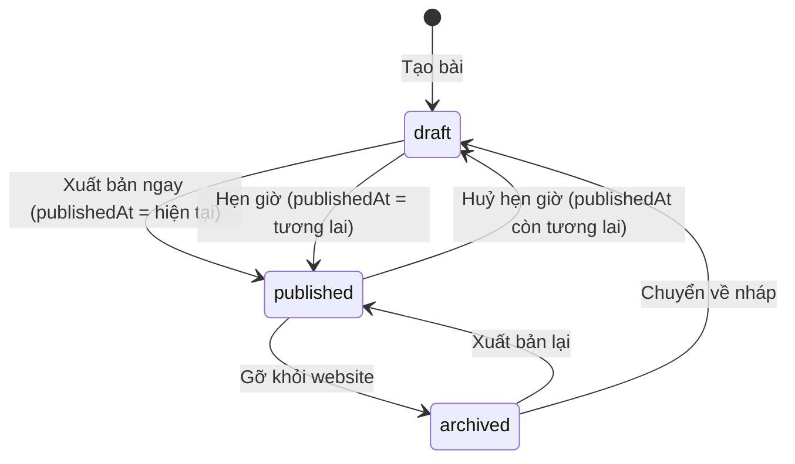
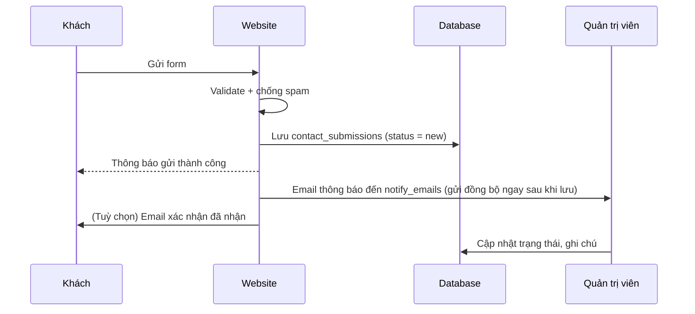
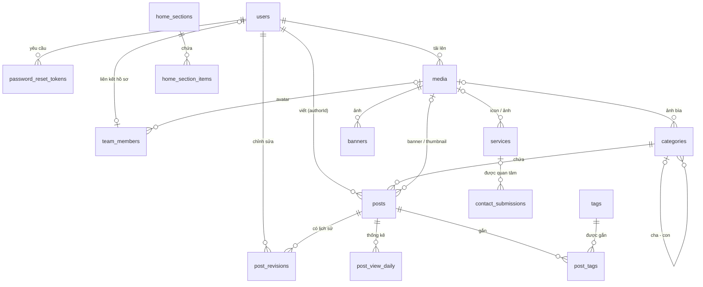

# Phân tích Hệ thống Quản trị & Cơ sở dữ liệu
## Website Tin tức Doanh nghiệp

> **Phiên bản:** 1.5 · **Ngày:** 12/09/2026
> **CSDL mục tiêu:** MySQL 8.0.19+ (InnoDB, utf8mb4)
> **Phạm vi:** Trang chủ · Danh mục tin tức · Bài viết · Dịch vụ · Đội ngũ · Liên hệ · Hệ thống quản trị (CMS)
> **Ghi chú phiên bản 1.1:** Hệ thống chỉ có **1 người dùng quản trị**, không cần phân quyền. Đã bỏ module Vai trò & quyền, Chuyển hướng URL, Nhật ký hoạt động và Phòng ban so với bản 1.0.
> **Ghi chú phiên bản 1.2:** Hệ thống **không dùng cronjob/job nền** — xuất bản hẹn giờ xử lý bằng điều kiện truy vấn, lượt xem ghi trực tiếp, email liên hệ gửi đồng bộ. Tên trường (column) CSDL dùng **camelCase**; tên bảng giữ `snake_case`.
> **Ghi chú phiên bản 1.3:** DB chỉ dùng **index** — **không có FOREIGN KEY** (tầng ứng dụng đảm bảo tính toàn vẹn của các tham chiếu); trạng thái & `type` dùng **`TINYINT UNSIGNED` + mã số** (không dùng `ENUM`/chuỗi).
> **Ghi chú phiên bản 1.4:** Bỏ toàn bộ `COMMENT` trong DDL — ý nghĩa từng cột và bảng mã số được mô tả ở bảng chú giải ngay dưới mỗi khối DDL. Toàn bộ SQL ở mục 5 và tham số API ở mục 6 được đồng bộ sang **camelCase** cho khớp DDL. Bổ sung `posts.previewToken` (xem trước bài chưa xuất bản) và gỡ các mô tả cronjob còn sót ở mục 5.7, 5.8, 7.4.
> **Ghi chú phiên bản 1.5:** **Bỏ hoàn toàn xoá mềm** — không còn cột `deletedAt` ở bất kỳ bảng nào, không còn thùng rác và chức năng khôi phục. Lệnh xoá là `DELETE` thật, có hộp thoại xác nhận. Vì DB không có FOREIGN KEY nên tầng ứng dụng **phải tự xoá các bản ghi con** trong cùng transaction (xem 4.6). Trạng thái `archived` của bài viết giờ là cách duy nhất để "gỡ khỏi website mà vẫn giữ dữ liệu".

---

## Mục lục

1. [Tổng quan](#1-tổng-quan)
2. [Sơ đồ chức năng](#2-sơ-đồ-chức-năng)
3. [Phân tích các module quản trị](#3-phân-tích-các-module-quản-trị)
4. [Thiết kế cơ sở dữ liệu](#4-thiết-kế-cơ-sở-dữ-liệu)
5. [Truy vấn tiêu biểu](#5-truy-vấn-tiêu-biểu)
6. [Route frontend & API quản trị](#6-route-frontend--api-quản-trị)
7. [Yêu cầu phi chức năng](#7-yêu-cầu-phi-chức-năng)
8. [Lộ trình triển khai](#8-lộ-trình-triển-khai)
9. [Các điểm cần chốt](#9-các-điểm-cần-chốt)

---

## 1. Tổng quan

### 1.1 Mục tiêu

Xây dựng website giới thiệu doanh nghiệp lấy **tin tức** làm trọng tâm: đăng bài theo danh mục, giới thiệu dịch vụ, giới thiệu đội ngũ nhân sự và tiếp nhận liên hệ từ khách hàng. Toàn bộ nội dung (kể cả banner và bố cục trang chủ) được quản trị qua CMS bởi **một quản trị viên duy nhất**, không cần can thiệp code.

### 1.2 Đối tượng sử dụng

| Đối tượng | Mô tả | Truy cập |
|---|---|---|
| Khách truy cập | Đọc tin, xem dịch vụ, đội ngũ, gửi form liên hệ | Frontend, không cần đăng nhập |
| Quản trị viên | Người dùng duy nhất của hệ thống; quản lý toàn bộ nội dung, giao diện, đội ngũ, liên hệ và cài đặt | Admin (CMS) – toàn quyền |

### 1.3 Giả định

- **Bổ sung module Dịch vụ.** Trang chủ cần hiển thị "dịch vụ đi kèm" nên phải có nơi quản lý dữ liệu dịch vụ. Tài liệu đề xuất module Dịch vụ gồm trang danh sách và trang chi tiết (có thể tắt trang chi tiết nếu chỉ cần hiển thị ở trang chủ).
- Mỗi bài viết thuộc **1 danh mục chính** và gắn được **nhiều tag**.
- Website **một ngôn ngữ** (tiếng Việt) ở giai đoạn đầu; hướng mở rộng đa ngôn ngữ nằm ở mục 8.
- Người đọc **không có tài khoản** (không đăng ký, không bình luận).
- **Hệ thống chỉ có 1 tài khoản quản trị, không phân vai trò/quyền hạn.** Quản trị viên có toàn quyền với mọi module, không cần bảng vai trò/quyền hay kiểm tra quyền sở hữu ở backend.
- **Bỏ quy trình gửi duyệt nhiều cấp.** Vì chỉ có 1 người vận hành, bài viết được soạn và xuất bản trực tiếp; không cần trạng thái "chờ duyệt" / "bị từ chối" hay người duyệt riêng biệt.
- **Nhân sự (Đội ngũ) tách biệt với tài khoản quản trị**: nhân sự là thông tin hiển thị trên website, không nhất thiết đăng nhập CMS; có thể liên kết tuỳ chọn với tài khoản quản trị khi nhân sự đó cũng là tác giả bài viết.
- **Không quản lý phòng ban riêng.** Nhân sự hiển thị theo một danh sách chung, sắp xếp bằng thứ tự thủ công.
- **Không có module chuyển hướng URL hay nhật ký hoạt động**, do chỉ 1 người vận hành nên không cần truy vết ai đã làm gì hay tự động dựng redirect. Khi đổi slug, quản trị viên tự cân nhắc và cập nhật lại các liên kết liên quan nếu cần.

---

## 2. Sơ đồ chức năng

### 2.1 Frontend (người dùng)

```
Trang chủ  (/)
├── Banner slider
├── Tin nổi bật
├── Dịch vụ tiêu biểu
├── Tin mới nhất / Tin theo danh mục
├── Đội ngũ tiêu biểu (tuỳ chọn)
└── Khối kêu gọi liên hệ (CTA)

Tin tức
├── Tất cả tin            /tin-tuc
├── Theo danh mục         /danh-muc/{category-slug}
├── Theo tag              /tag/{tag-slug}
├── Tìm kiếm              /tim-kiem?q=
└── Chi tiết bài viết     /tin-tuc/{post-slug}
    ├── Ảnh banner, tiêu đề, danh mục, tác giả, ngày đăng, thời gian đọc
    ├── Nội dung, tag, nút chia sẻ
    └── Bài viết liên quan

Dịch vụ
├── Danh sách             /dich-vu
└── Chi tiết              /dich-vu/{service-slug}

Đội ngũ                   /doi-ngu
Liên hệ                   /lien-he
```

> **Vì sao URL bài viết không chứa slug danh mục?** Khi chuyển bài sang danh mục khác, URL vẫn giữ nguyên, tránh phát sinh liên kết hỏng và mất thứ hạng SEO. Breadcrumb vẫn hiển thị danh mục bình thường.

### 2.2 Admin (CMS)

```
/admin
├── Dashboard
├── Nội dung
│   ├── Bài viết
│   ├── Danh mục
│   ├── Tag
│   └── Dịch vụ
├── Giao diện
│   ├── Banner
│   ├── Bố cục trang chủ
│   └── Menu
├── Đội ngũ (Nhân sự)
├── Liên hệ (hộp thư)
├── Thư viện media
└── Hệ thống
    ├── Tài khoản của tôi
    └── Cài đặt chung
```

---

## 3. Phân tích các module quản trị

### 3.1 Dashboard

| Widget | Nguồn dữ liệu |
|---|---|
| Số bài theo trạng thái | `posts` |
| Liên hệ mới chưa xử lý | `contact_submissions.status = 0` (0=new) |
| Top bài xem nhiều 7 / 30 ngày | `post_view_daily` |
| Biểu đồ lượt xem theo ngày | `post_view_daily` |

### 3.2 Danh mục tin tức

**Chức năng:** thêm / sửa / xoá, hiển thị dạng cây tối đa 2 cấp, kéo thả sắp xếp, bật/tắt hiển thị, cấu hình SEO.

| Trường | Bắt buộc | Ghi chú |
|---|:-:|---|
| Tên danh mục | ✅ | ≤ 150 ký tự |
| Slug | ✅ | Tự sinh từ tên (bỏ dấu tiếng Việt, `đ → d`), cho phép sửa, duy nhất |
| Danh mục cha | | Chỉ chọn danh mục cấp 1 |
| Mô tả | | Hiển thị đầu trang danh mục |
| Ảnh đại diện | | Chọn từ thư viện media |
| Thứ tự | | Mặc định 0, cập nhật khi kéo thả |
| Hiển thị | | Bật/tắt |
| Meta title / Meta description | | Để trống thì dùng tên / mô tả |

**Quy tắc nghiệp vụ**

- Không cho chọn chính nó hoặc danh mục con của nó làm danh mục cha; độ sâu tối đa 2 cấp.
- **Không cho xoá** danh mục còn danh mục con hoặc còn bài viết (kể cả bài nháp và bài lưu trữ). Giao diện gợi ý chuyển bài sang danh mục khác trước khi xoá. Đây là hàng rào quan trọng vì xoá danh mục là xoá cứng, không khôi phục được.
- **Tắt danh mục**: ẩn khỏi menu và các trang danh sách; bài viết bên trong vẫn truy cập được qua URL trực tiếp.
- **Đổi slug** của danh mục đã có bài xuất bản sẽ làm URL cũ mất hiệu lực; do hệ thống không có module chuyển hướng, quản trị viên cần cân nhắc kỹ trước khi đổi và tự cập nhật các liên kết ngoài (nếu có).
- Trang danh mục cấp 1 hiển thị bài của chính nó **và** của các danh mục con.

### 3.3 Bài viết

#### 3.3.1 Màn hình danh sách

- Tab theo trạng thái kèm số lượng: Tất cả · Nháp · Hẹn giờ · Đã xuất bản · Lưu trữ (Hẹn giờ và Đã xuất bản cùng thuộc trạng thái `published`, phân biệt bằng `publishedAt`). **Không có tab Thùng rác** — hệ thống xoá cứng.
- Bộ lọc: danh mục, tag, khoảng ngày xuất bản, nổi bật; tìm theo tiêu đề.
- Cột: ảnh thumbnail, tiêu đề, danh mục, trạng thái, ngày xuất bản, lượt xem.
- Thao tác hàng loạt: xuất bản, lưu trữ, chuyển danh mục, xoá.
- **Xoá là vĩnh viễn**: nút Xoá hiển thị hộp thoại xác nhận nêu rõ "không thể khôi phục", yêu cầu bấm xác nhận lần hai; xoá hàng loạt bắt buộc gõ đúng số lượng bài để xác nhận. Muốn gỡ bài khỏi website mà vẫn giữ dữ liệu thì dùng **Lưu trữ**, giao diện nên đặt Lưu trữ làm hành động chính và Xoá làm hành động phụ.

#### 3.3.2 Màn hình soạn thảo

| Nhóm | Trường | Bắt buộc | Ghi chú |
|---|---|:-:|---|
| Nội dung | Tiêu đề | ✅ | ≤ 255 ký tự |
| | Slug | ✅ | Tự sinh, trùng thì thêm hậu tố `-2`, `-3`… |
| | Tóm tắt (sapo) | | ≤ 500 ký tự, dùng cho danh sách và meta description mặc định |
| | Nội dung | ✅ | Trình soạn thảo rich text (CKEditor 5 / TinyMCE): định dạng, chèn ảnh từ thư viện, bảng, embed YouTube |
| Hình ảnh | **Ảnh banner** | ✅ khi xuất bản | Ảnh lớn đầu bài, tỉ lệ khuyến nghị 16:9, tối thiểu 1200×675; đồng thời dùng làm ảnh chia sẻ mạng xã hội (og:image) |
| | Ảnh thumbnail | | Ảnh ở trang danh sách; để trống thì dùng biến thể thu nhỏ của banner |
| Phân loại | Danh mục | ✅ | 1 danh mục |
| | Tag | | Nhiều tag, gõ để tìm hoặc tạo mới |
| Xuất bản | Trạng thái | ✅ | Xem 3.3.3 |
| | Thời gian xuất bản | | Chọn thời điểm tương lai để hẹn giờ |
| | Nổi bật | | Đưa vào khối "Tin nổi bật" ở trang chủ |
| SEO | Meta title | | Khuyến nghị ≤ 60 ký tự, có bộ đếm |
| | Meta description | | Khuyến nghị ≤ 160 ký tự, có xem trước kết quả Google |

**Tiện ích soạn thảo:** tự lưu (autosave) mỗi 60 giây khi có thay đổi, xem trước bài chưa xuất bản qua link có token, cảnh báo khi rời trang chưa lưu.

> **Token xem trước:** mỗi bài có `posts.previewToken` (chuỗi ngẫu nhiên 32 ký tự, sinh khi tạo bài). Link xem trước `/tin-tuc/{slug}?previewToken=...` bỏ qua điều kiện `status` / `publishedAt`, và trang preview luôn gắn `noindex`. Nút "Tạo lại link xem trước" sinh token mới, vô hiệu hoá link cũ.

#### 3.3.3 Quy trình trạng thái



| Trạng thái | Ý nghĩa | Hiển thị ngoài website |
|---|---|:-:|
| `draft` | Nháp, đang soạn | ❌ |
| `published` | Đã xuất bản. `publishedAt` ở tương lai = đang **hẹn giờ**; đến thời điểm thì bài tự hiển thị, không cần cronjob | ✅ khi `publishedAt <= NOW()` |
| `archived` | Lưu trữ, gỡ khỏi website nhưng giữ dữ liệu. **Đây là cách duy nhất để ẩn bài mà không mất dữ liệu** | ❌ |

> Không có trạng thái `scheduled` riêng trong DB: hẹn giờ chỉ là `published` với `publishedAt` trong tương lai. Điều kiện `publishedAt <= NOW()` nằm ngay trong các truy vấn công khai nên không cần job nền chuyển trạng thái (xem 5.7). Mã số: `0`=draft · `1`=published · `2`=archived.

#### 3.3.4 Quy tắc nghiệp vụ

1. **Điều kiện hiển thị công khai:** `status = 1 AND publishedAt <= NOW()`. Nhờ kiểm tra `publishedAt` ngay trong truy vấn, bài hẹn giờ **tự xuất hiện đúng thời điểm mà không cần cronjob**.
2. **`publishedAt` chỉ gán khi xuất bản** (thời điểm hiện tại, hoặc thời điểm tương lai nếu hẹn giờ) và không đổi ở các lần chỉnh sửa sau; frontend hiển thị thêm "Cập nhật lúc" từ `updatedAt` nếu cần. Huỷ hẹn giờ đưa bài về nháp và xoá `publishedAt`.
3. **Ảnh banner bắt buộc khi xuất bản (ngay hoặc hẹn giờ)**; nháp được phép chưa có ảnh.
4. **Đổi slug bài đã xuất bản** sẽ làm URL cũ mất hiệu lực; hệ thống không tự tạo chuyển hướng nên cần cân nhắc trước khi đổi.
5. **Lịch sử phiên bản:** mỗi lần lưu thủ công hoặc trước khi xuất bản tạo 1 bản ghi `post_revisions`; giữ 20 bản gần nhất mỗi bài — cắt bớt ngay sau khi lưu, không cần job (autosave chỉ giữ 1 bản mới nhất, xem 5.13). Cho phép so sánh và khôi phục.
6. **Lọc XSS phía server** cho nội dung HTML trước khi lưu (HTMLPurifier với danh sách thẻ/thuộc tính cho phép, cho phép iframe YouTube).
7. **Thời gian đọc** = số từ ÷ 200 (làm tròn lên, tối thiểu 1 phút), tính khi lưu.
8. **Bài viết liên quan:** ưu tiên bài có nhiều tag chung → cùng danh mục → mới nhất; tối đa 4 bài.
9. **Lượt xem:** ghi trực tiếp xuống DB ngay khi có lượt xem hợp lệ (không đếm trùng cùng cookie/phiên trong 30 phút, không đếm bot; xem 5.8). Lưu lượng website doanh nghiệp thấp nên ghi trực tiếp là đủ; nếu sau này tăng cao mới cân nhắc bộ đệm ghi theo lô.
10. **Xoá cứng, không khôi phục được.** Xoá bài chạy `DELETE` thật trong một transaction, kèm việc xoá các bản ghi con (`post_tags`, `post_revisions`, `post_view_daily`, `home_section_items`) — xem 4.6. Slug được giải phóng ngay sau khi xoá. Ảnh trong thư viện media **không** bị xoá theo, vì có thể đang dùng ở bài khác.

### 3.4 Tag

- Danh sách tag kèm số bài sử dụng; thêm / sửa / xoá.
- **Gộp tag** (merge): chuyển toàn bộ bài từ tag A sang tag B rồi xoá A. Vì không có module chuyển hướng, URL `/tag/a` cũ sẽ trả 404 sau khi gộp — cân nhắc trước khi thực hiện với tag đang có nhiều bài.
- Khi gắn tag trong form bài viết: gõ để tìm; chưa có thì tạo mới (slug chuẩn hoá để tránh trùng kiểu "Hà Nội" / "ha noi").

### 3.5 Dịch vụ

| Trường | Bắt buộc | Ghi chú |
|---|:-:|---|
| Dịch vụ cha | | NULL = dịch vụ gốc; trỏ tới dịch vụ cha (tối đa 1 cấp, 16/09) |
| Tên dịch vụ | ✅ | |
| Slug | ✅ | Duy nhất |
| Mô tả ngắn | | Hiển thị ở thẻ dịch vụ trang chủ |
| Nội dung chi tiết | | Rich text, dùng cho trang chi tiết |
| Icon | | Ảnh vuông nhỏ (PNG/WebP) |
| Ảnh đại diện | | |
| Thứ tự, Hiển thị | | |
| Meta title / description | | |

Dịch vụ còn xuất hiện trong dropdown "Dịch vụ quan tâm" của form liên hệ → khi tắt dịch vụ, ẩn khỏi dropdown nhưng giữ liên kết ở các liên hệ cũ.

### 3.6 Banner

| Trường | Bắt buộc | Ghi chú |
|---|:-:|---|
| Vị trí | ✅ | `home_hero` (mặc định); để sẵn cho vị trí khác sau này như `news_top` |
| Tiêu đề, Phụ đề | | Chữ đè lên ảnh |
| Ảnh desktop | ✅ | Khuyến nghị 1920×700 |
| Ảnh mobile | | Khuyến nghị 768×960; trống thì dùng ảnh desktop |
| Liên kết, Mở tab mới | | |
| Chữ trên nút | | VD: "Xem thêm" |
| Thứ tự, Hiển thị | | Kéo thả sắp xếp |
| Bắt đầu / Kết thúc | | Để trống = không giới hạn |

**Điều kiện hiển thị:** `isActive = 1` và thời điểm hiện tại nằm trong khoảng `[startAt, endAt]` (bỏ qua vế nào bằng NULL).

### 3.7 Bố cục trang chủ

Trang chủ được chia thành các **khối (section)**. Quản trị viên bật/tắt, kéo thả đổi thứ tự, đổi tiêu đề và tham số của từng khối.

| Loại khối (`type`) | Nội dung | Tham số `config` (JSON) |
|---|---|---|
| `hero_banner` | Slider banner vị trí `home_hero` | `{"autoplay": true, "interval_ms": 5000}` |
| `featured_posts` | Tin nổi bật | `{"mode": "auto" \| "manual", "limit": 5}` |
| `latest_posts` | Tin mới nhất | `{"limit": 6}` |
| `category_posts` | Tin của một danh mục | `{"category_id": 3, "limit": 4}` |
| `services` | Dịch vụ | `{"mode": "auto" \| "manual", "limit": 6}` |
| `team` | Nhân sự nổi bật | `{"mode": "auto" \| "manual", "limit": 4}` |
| `process` | Quy trình chuyên nghiệp (16/09) | `{"steps":[{"title":"…","desc":"…"},…]}` 3-6 bước |
| `contact_cta` | Kêu gọi liên hệ | `{"button_text": "Liên hệ ngay", "button_url": "/lien-he"}` |

> Mã số của `type`: `1`=hero_banner · `2`=featured_posts · `3`=latest_posts · `4`=category_posts · `5`=services · `6`=team · `7`=contact_cta · `8`=process (16/09) (cột `home_sections.type` TINYINT UNSIGNED, xem 4.4.4). Khoá trong `config` giữ nguyên `snake_case` vì đây là JSON tham số, không phải tên cột.

- **`mode = auto`:** bài nổi bật lấy theo `isFeatured = 1` mới nhất; dịch vụ lấy theo `sortOrder`; đội ngũ lấy theo `isFeatured = 1`.
- **`mode = manual`:** chọn cụ thể từng mục và thứ tự, lưu ở `home_section_items`. Mục bị ẩn/xoá sẽ tự bị bỏ qua khi render.
- Backend **validate `config` theo từng `type`** trước khi lưu (VD: `category_id` phải tồn tại).
- Dữ liệu trang chủ được **cache**; xoá cache khi bài viết, banner, dịch vụ, nhân sự hoặc section thay đổi.

### 3.8 Đội ngũ

**Nhân sự:**

| Trường | Bắt buộc | Ghi chú |
|---|:-:|---|
| Họ tên | ✅ | |
| Chức danh | ✅ | VD: "Giám đốc Kinh doanh" |
| Ảnh đại diện | ✅ | Tỉ lệ 1:1, tối thiểu 600×600 |
| Giới thiệu | | |
| Email, Số điện thoại | | Chỉ hiển thị khi bật "Công khai liên hệ" |
| Mạng xã hội | | Facebook, LinkedIn, Zalo… |
| Tài khoản CMS liên kết | | Nếu nhân sự cũng là tác giả → dùng ảnh, chức danh cho hộp tác giả cuối bài |
| Thứ tự, Nổi bật, Hiển thị | | "Nổi bật" dùng cho khối Đội ngũ ở trang chủ |

- Sắp xếp frontend: theo `team_members.sortOrder` (một danh sách chung, không nhóm theo phòng ban).
- Thông tin cá nhân (ảnh, email, SĐT) chỉ công khai khi nhân sự đã đồng ý.

### 3.9 Bảng giá (16/09, cập nhật phân trang 17/09)

Bảng giá Medlatec-style hiển thị tại `/bang-gia` (filter `?nhom=<groupCode>&q=<keyword>&page=<n>`), nhóm theo `groupCode` (general/hospital/home), bảng 4 cột STT/Tên dịch vụ/Giá dịch vụ/Giá BHYT. Dữ liệu hiện chỉ có giá dịch vụ; cột BHYT hiển thị `—` cho tới khi có trường riêng. Giá `NULL` hiện “Liên hệ”. Nguồn `pricing_items` (Frontend sở hữu, Admin CRUD qua `PricingService`, cache một key `pricing-v1` TTL 60s; filter + phân trang 20 dòng/trang chạy trên mảng đã cache). Trang `/dich-vu` Box4 nhúng 10 dòng đầu + link tới `/bang-gia`.

| Trường | Bắt buộc | Ghi chú |
|---|:-:|---|
| Nhóm | ✅ | `general`/`hospital`/`home` |
| Tên | ✅ | |
| Slug | ✅ | Duy nhất |
| Giá | | NULL = “Liên hệ” |
| Đơn vị | | VD: lần/gói |
| Ghi chú | | |
| Thứ tự, Hiển thị | | Kéo thả |

### 3.10 Menu (17/09)

Menu header ngoài frontend được quản lý tại `/admin/menus`. Quản trị viên tạo/sửa/xoá mục menu, bật/tắt hiển thị và kéo thả đổi thứ tự; layout frontend render qua `FrontendMenu` helper, cache một key `menu-v1` TTL 60 giây và tự fallback menu mặc định khi DB chưa migrate.

| Trường | Bắt buộc | Ghi chú |
|---|:-:|---|
| Nhãn | ✅ | ≤ 120 ký tự |
| URL | ✅ | Cho phép đường dẫn nội bộ `/...`, `http(s)://...`, `mailto:...`, `tel:...` |
| Mở liên kết | ✅ | `_self` hoặc `_blank` |
| Thứ tự, Hiển thị | | Kéo thả ngoài admin; frontend chỉ đọc mục đang bật |

### 3.11 Liên hệ

**Form ngoài website** (16/09 — form đã bỏ ở Frontend, chỉ hiện SĐT/Zalo/địa chỉ/bản đồ; Service Contact giữ để Admin xem inbox cũ)

| Trường | Bắt buộc |
|---|:-:|
| Họ tên | ✅ |
| Email | ✅ |
| Số điện thoại | |
| Dịch vụ quan tâm (dropdown) | |
| Tiêu đề | |
| Nội dung | ✅ |
| Đồng ý cho phép xử lý dữ liệu cá nhân (checkbox) | ✅ |

**Chống spam:** trường honeypot ẩn; giới hạn 3 lần gửi / IP / 10 phút; Cloudflare Turnstile hoặc reCAPTCHA v3; validate toàn bộ ở server.

**Luồng xử lý:**



> **Không dùng hàng đợi/job nền:** email gửi đồng bộ với timeout ngắn; nếu gửi lỗi thì ghi log để gửi lại thủ công, không ảnh hưởng phản hồi thành công cho khách.

**Admin – hộp thư liên hệ:** lọc theo trạng thái / khoảng ngày / dịch vụ, xem chi tiết, ghi chú nội bộ, đánh dấu spam, xuất Excel.

| Trạng thái | Ý nghĩa |
|---|---|
| `new` | Mới, chưa xử lý |
| `processing` | Đang xử lý |
| `done` | Đã xử lý xong (ghi nhận `handledAt`) |
| `spam` | Spam, ẩn khỏi danh sách mặc định |

> Mã số: `0`=new · `1`=processing · `2`=done · `3`=spam (cột `contact_submissions.status` TINYINT UNSIGNED).

**Thông tin liên hệ công ty** (địa chỉ, hotline, email, giờ làm việc, bản đồ) hiển thị trên trang Liên hệ và footer, quản lý tại **Cài đặt chung**.

> **Dữ liệu cá nhân:** form thu thập họ tên, email, SĐT nên cần checkbox đồng ý, trang chính sách bảo mật và thời hạn lưu trữ rõ ràng (VD: tự xoá/ẩn danh liên hệ sau 24 tháng). Nên rà soát với bộ phận pháp chế theo quy định bảo vệ dữ liệu cá nhân hiện hành của Việt Nam.

### 3.12 Thư viện media

- Upload kéo thả nhiều file; định dạng cho phép: JPG, PNG, WebP, GIF; dung lượng ≤ 5 MB/file.
- **Không cho upload SVG** (có thể chứa script) trừ khi có bước làm sạch.
- Kiểm tra MIME thật từ nội dung file, không tin phần mở rộng.
- Đổi tên file thành chuỗi ngẫu nhiên, lưu theo thư mục năm/tháng: `uploads/2026/09/a8f3c1e2.webp`.
- Tự sinh các biến thể: `thumb` (400px), `medium` (800px), `large` (1600px) và bản WebP.
- Lưu **đường dẫn tương đối**, không lưu URL tuyệt đối → dễ chuyển sang S3/CDN.
- Sửa **alt text** (phục vụ SEO và người khiếm thị).
- Khi xoá: **kiểm tra nơi sử dụng trước (xem 5.14) và chặn xoá** nếu file đang được dùng (banner bài viết, banner trang chủ, dịch vụ, nhân sự, cài đặt, hoặc chèn trong nội dung bài) — vì xoá là vĩnh viễn, cảnh báo suông không đủ. Chỉ cho phép xoá khi danh sách sử dụng rỗng, hoặc khi quản trị viên xác nhận ghi đè cảnh báo cho trường hợp file chỉ được chèn trong nội dung bài.
- Xoá bản ghi `media` đồng thời xoá **file gốc và toàn bộ biến thể** trên đĩa; nếu xoá file vật lý lỗi thì rollback transaction để tránh bản ghi mồ côi.

### 3.13 Tài khoản quản trị

Hệ thống chỉ có **1 tài khoản quản trị duy nhất** — không có màn hình quản lý danh sách người dùng, không có vai trò hay quyền hạn để cấu hình.

| Trường | Ghi chú |
|---|---|
| Họ tên, Email, SĐT, Ảnh đại diện | Email dùng để đăng nhập |
| Mật khẩu | Đổi trực tiếp trong màn hình tài khoản |

- Mật khẩu băm bằng `password_hash()` (Argon2id hoặc bcrypt); tối thiểu 8 ký tự.
- **Khoá tạm 15 phút sau 5 lần đăng nhập sai** liên tiếp, để bảo vệ tài khoản duy nhất khỏi tấn công dò mật khẩu.
- Quên mật khẩu: gửi link chứa token ngẫu nhiên, **chỉ lưu hash của token**, hết hạn sau 60 phút, dùng 1 lần.
- Tuỳ chọn mở rộng: xác thực 2 lớp (TOTP).

### 3.14 Cài đặt chung

| Nhóm | Khoá cài đặt |
|---|---|
| `general` | `site_name`, `site_logo`, `site_favicon`, `footer_text` |
| `contact` | `company_name`, `address`, `hotline`, `email`, `working_hours`, `map_address` (một ô chung trong Admin để dựng bản đồ), `map_embed_url` (legacy fallback, không hiển thị ở form), `notify_emails` |
| `social` | `facebook_url`, `youtube_url`, `zalo_url`, `linkedin_url` |
| `seo` | `default_meta_title`, `default_meta_description`, `default_og_image`, `ga_measurement_id` |

- Bản đồ FE ưu tiên **địa chỉ text** (`map_address`; nếu trống thì dùng `address`) để khi đổi địa chỉ trong Admin thì Google Map đổi theo. Admin chỉ hiển thị **một ô "Địa chỉ Google Map"**; `map_embed_url` chỉ là fallback legacy cho dữ liệu cũ khi chưa có địa chỉ nào. Không lưu nguyên thẻ `<iframe>` do admin dán vào (tránh XSS).
- **Cấu hình nhạy cảm** (SMTP, khoá API captcha, thông tin S3) để trong file cấu hình/biến môi trường, **không lưu trong DB**.
- Cache toàn bộ settings; xoá cache khi lưu.

---

## 4. Thiết kế cơ sở dữ liệu

### 4.1 Quy ước

| Hạng mục | Quy ước |
|---|---|
| Hệ quản trị | MySQL 8.0.19+ (cần cú pháp `INSERT ... AS new_row` ở 5.8), engine InnoDB |
| Bảng mã | `utf8mb4`, collation `utf8mb4_0900_ai_ci` |
| Đặt tên | Bảng: `snake_case`, số nhiều · **Trường (column): `camelCase`** · trường tham chiếu dạng `<tên>Id` (VD `categoryId`) |
| Khoá ngoại | **Không khai báo FOREIGN KEY**; mọi cột tham chiếu chỉ có index. Tầng ứng dụng chịu trách nhiệm kiểm tra tồn tại khi ghi và bỏ qua bản ghi mồ côi khi đọc |
| Khoá chính | `INT UNSIGNED AUTO_INCREMENT`; bảng tăng nhanh (liên hệ, revision) dùng `BIGINT UNSIGNED` |
| Thời gian | `createdAt`, `updatedAt`. Lưu giờ UTC — **kết nối phải đặt `time_zone = '+00:00'`** ngay sau khi mở (nếu không, `CURRENT_TIMESTAMP` và `NOW()` sẽ lệch múi giờ); đổi sang giờ Việt Nam ở tầng hiển thị |
| Xoá dữ liệu | **Xoá cứng (`DELETE`)** ở mọi bảng — không có `deletedAt`, không có thùng rác, không khôi phục được. Vì không có FOREIGN KEY nên tầng ứng dụng phải tự xoá bản ghi con trong cùng transaction (xem 4.6) |
| Boolean | `TINYINT(1)` với tiền tố `is` / `show` (VD `isActive`, `showContact`) |
| Trạng thái / `type` | `TINYINT UNSIGNED` + mã số (VD: `0`=draft · `1`=published · `2`=archived); bảng mã số nằm ở phần chú giải ngay dưới mỗi khối DDL — không dùng `ENUM` / chuỗi |
| Chú thích | **DDL không dùng `COMMENT`** ở cột lẫn bảng; mọi diễn giải đặt trong tài liệu này |
| Ảnh | Tham chiếu `media.id`, không lưu URL trực tiếp trong bảng nội dung |
| Slug | `UNIQUE` trên toàn bảng; xoá bản ghi là giải phóng slug ngay, có thể dùng lại cho nội dung mới |

### 4.2 Danh sách bảng

| # | Bảng | Nhóm | Mô tả |
|---|---|---|---|
| 1 | `users` | Hệ thống | Tài khoản quản trị (duy nhất) |
| 2 | `password_reset_tokens` | Hệ thống | Token đặt lại mật khẩu |
| 3 | `media` | Media | Thư viện file |
| 4 | `categories` | Tin tức | Danh mục (cây 2 cấp) |
| 5 | `tags` | Tin tức | Tag |
| 6 | `posts` | Tin tức | Bài viết |
| 7 | `post_tags` | Tin tức | Bài viết ↔ tag |
| 8 | `post_revisions` | Tin tức | Lịch sử phiên bản bài viết |
| 9 | `post_view_daily` | Tin tức | Thống kê lượt xem theo ngày |
| 10 | `services` | Dịch vụ | Dịch vụ |
| 11 | `banners` | Giao diện | Banner |
| 12 | `home_sections` | Giao diện | Các khối trang chủ |
| 13 | `home_section_items` | Giao diện | Mục chọn thủ công trong khối |
| 14 | `team_members` | Đội ngũ | Nhân sự |
| 15 | `contact_submissions` | Liên hệ | Liên hệ từ khách |
| 16 | `pricing_items` | Bảng giá | Bảng giá (16/09) |
| 17 | `menu_items` | Giao diện | Menu frontend (17/09) |
| 18 | `settings` | Hệ thống | Cài đặt chung |

### 4.3 Sơ đồ quan hệ (ERD)



> `home_section_items` tham chiếu đa hình (`itemType` + `itemId`) tới `posts` / `services` / `team_members` nên không có khoá ngoại; tầng ứng dụng kiểm tra tồn tại và bỏ qua mục đã ẩn/xoá khi render.

### 4.4 DDL chi tiết

#### 4.4.1 Tài khoản quản trị

```sql
SET NAMES utf8mb4;
SET time_zone = '+00:00';

CREATE TABLE users (
  id               INT UNSIGNED NOT NULL AUTO_INCREMENT,
  fullName         VARCHAR(150) NOT NULL,
  email            VARCHAR(255) NOT NULL,
  passwordHash     VARCHAR(255) NOT NULL,
  phone            VARCHAR(20)  NULL,
  avatarMediaId    INT UNSIGNED NULL,
  failedLoginCount TINYINT UNSIGNED NOT NULL DEFAULT 0,
  lockedUntil      DATETIME NULL,
  lastLoginAt      DATETIME NULL,
  createdAt        DATETIME NOT NULL DEFAULT CURRENT_TIMESTAMP,
  updatedAt        DATETIME NOT NULL DEFAULT CURRENT_TIMESTAMP ON UPDATE CURRENT_TIMESTAMP,
  PRIMARY KEY (id),
  UNIQUE KEY uq_users_email (email),
  KEY idx_users_avatar (avatarMediaId)
) ENGINE=InnoDB DEFAULT CHARSET=utf8mb4 COLLATE=utf8mb4_0900_ai_ci;

CREATE TABLE password_reset_tokens (
  id         INT UNSIGNED NOT NULL AUTO_INCREMENT,
  userId     INT UNSIGNED NOT NULL,
  tokenHash  CHAR(64)     NOT NULL,
  expiresAt  DATETIME     NOT NULL,
  usedAt     DATETIME     NULL,
  createdAt  DATETIME     NOT NULL DEFAULT CURRENT_TIMESTAMP,
  PRIMARY KEY (id),
  UNIQUE KEY uq_password_reset_tokens_hash (tokenHash),
  KEY idx_password_reset_tokens_user (userId)
) ENGINE=InnoDB DEFAULT CHARSET=utf8mb4 COLLATE=utf8mb4_0900_ai_ci;
```

**Chú giải**

| Cột | Ý nghĩa |
|---|---|
| `users.passwordHash` | Kết quả `password_hash()` — Argon2id hoặc bcrypt |
| `users.failedLoginCount` | Số lần đăng nhập sai liên tiếp; reset về 0 khi đăng nhập thành công |
| `users.lockedUntil` | Khoá tạm do đăng nhập sai nhiều lần; `NULL` = không khoá |
| `password_reset_tokens.tokenHash` | SHA-256 của token gửi qua email; **không lưu token gốc** |
| `password_reset_tokens.usedAt` | Khác `NULL` = token đã dùng, không cho dùng lại |

> Không còn bảng `roles`, `permissions`, `role_permissions` vì hệ thống không phân quyền. Tầng ứng dụng đảm bảo bảng `users` chỉ có tối đa 1 bản ghi.
> Token đặt lại mật khẩu hợp lệ khi `usedAt IS NULL AND expiresAt > NOW()`. Do không có job dọn dẹp, mỗi lần tạo token mới thì xoá luôn các token cũ của cùng `userId`.

#### 4.4.2 Media

```sql
CREATE TABLE media (
  id           INT UNSIGNED NOT NULL AUTO_INCREMENT,
  disk         VARCHAR(20)  NOT NULL DEFAULT 'local',
  path         VARCHAR(500) NOT NULL,
  originalName VARCHAR(255) NOT NULL,
  mimeType     VARCHAR(100) NOT NULL,
  sizeBytes    INT UNSIGNED NOT NULL,
  width        SMALLINT UNSIGNED NULL,
  height       SMALLINT UNSIGNED NULL,
  altText      VARCHAR(255) NULL,
  variants     JSON NULL,
  uploadedBy   INT UNSIGNED NULL,
  createdAt    DATETIME NOT NULL DEFAULT CURRENT_TIMESTAMP,
  updatedAt    DATETIME NOT NULL DEFAULT CURRENT_TIMESTAMP ON UPDATE CURRENT_TIMESTAMP,
  PRIMARY KEY (id),
  UNIQUE KEY uq_media_path (path),
  KEY idx_media_mime (mimeType),
  KEY idx_media_uploaded_by (uploadedBy),
  KEY idx_media_created (createdAt)
) ENGINE=InnoDB DEFAULT CHARSET=utf8mb4 COLLATE=utf8mb4_0900_ai_ci;
```

**Chú giải**

| Cột | Ý nghĩa |
|---|---|
| `disk` | Nơi lưu file: `local` hoặc `s3` |
| `path` | Đường dẫn **tương đối** trong disk, VD `2026/09/a8f3c1e2.webp` (UNIQUE để tránh ghi đè khi trùng tên ngẫu nhiên) |
| `mimeType` | MIME đọc từ nội dung file (`finfo`), không lấy theo phần mở rộng |
| `variants` | JSON các biến thể đã resize: `{"thumb":"...","medium":"...","large":"...","webp":"..."}` |
| `uploadedBy` | `users.id` đã upload; `NULL` khi bản ghi cũ không xác định |

> Xoá media là **xoá cứng**: xoá bản ghi và mọi file vật lý (bản gốc + biến thể trong `variants`). Phải chạy 5.14 để chặn xoá file đang được sử dụng.

#### 4.4.3 Tin tức

```sql
CREATE TABLE categories (
  id              INT UNSIGNED NOT NULL AUTO_INCREMENT,
  parentId        INT UNSIGNED NULL,
  name            VARCHAR(150) NOT NULL,
  slug            VARCHAR(255) NOT NULL,
  description     VARCHAR(500) NULL,
  coverMediaId    INT UNSIGNED NULL,
  sortOrder       INT          NOT NULL DEFAULT 0,
  isActive        TINYINT(1)   NOT NULL DEFAULT 1,
  metaTitle       VARCHAR(255) NULL,
  metaDescription VARCHAR(500) NULL,
  createdAt       DATETIME NOT NULL DEFAULT CURRENT_TIMESTAMP,
  updatedAt       DATETIME NOT NULL DEFAULT CURRENT_TIMESTAMP ON UPDATE CURRENT_TIMESTAMP,
  PRIMARY KEY (id),
  UNIQUE KEY uq_categories_slug (slug),
  KEY idx_categories_parent_sort (parentId, sortOrder),
  KEY idx_categories_cover (coverMediaId)
) ENGINE=InnoDB DEFAULT CHARSET=utf8mb4 COLLATE=utf8mb4_0900_ai_ci;

CREATE TABLE tags (
  id         INT UNSIGNED NOT NULL AUTO_INCREMENT,
  name       VARCHAR(100) NOT NULL,
  slug       VARCHAR(120) NOT NULL,
  createdAt  DATETIME NOT NULL DEFAULT CURRENT_TIMESTAMP,
  updatedAt  DATETIME NOT NULL DEFAULT CURRENT_TIMESTAMP ON UPDATE CURRENT_TIMESTAMP,
  PRIMARY KEY (id),
  UNIQUE KEY uq_tags_slug (slug)
) ENGINE=InnoDB DEFAULT CHARSET=utf8mb4 COLLATE=utf8mb4_0900_ai_ci;

CREATE TABLE posts (
  id               INT UNSIGNED NOT NULL AUTO_INCREMENT,
  categoryId       INT UNSIGNED NOT NULL,
  authorId         INT UNSIGNED NULL,
  title            VARCHAR(255) NOT NULL,
  slug             VARCHAR(255) NOT NULL,
  excerpt          VARCHAR(500) NULL,
  content          MEDIUMTEXT   NOT NULL,
  bannerMediaId    INT UNSIGNED NULL,
  thumbnailMediaId INT UNSIGNED NULL,
  status           TINYINT UNSIGNED NOT NULL DEFAULT 0,
  isFeatured       TINYINT(1)   NOT NULL DEFAULT 0,
  publishedAt      DATETIME     NULL,
  viewCount        INT UNSIGNED NOT NULL DEFAULT 0,
  readingMinutes   SMALLINT UNSIGNED NOT NULL DEFAULT 1,
  previewToken     CHAR(32)     NULL,
  metaTitle        VARCHAR(255) NULL,
  metaDescription  VARCHAR(500) NULL,
  createdAt        DATETIME NOT NULL DEFAULT CURRENT_TIMESTAMP,
  updatedAt        DATETIME NOT NULL DEFAULT CURRENT_TIMESTAMP ON UPDATE CURRENT_TIMESTAMP,
  PRIMARY KEY (id),
  UNIQUE KEY uq_posts_slug (slug),
  UNIQUE KEY uq_posts_preview_token (previewToken),
  KEY idx_posts_status_published (status, publishedAt),
  KEY idx_posts_category_status_published (categoryId, status, publishedAt),
  KEY idx_posts_featured_status_published (isFeatured, status, publishedAt),
  KEY idx_posts_author (authorId),
  KEY idx_posts_banner_media (bannerMediaId),
  KEY idx_posts_thumbnail_media (thumbnailMediaId),
  FULLTEXT KEY ft_posts_title_excerpt (title, excerpt)
) ENGINE=InnoDB DEFAULT CHARSET=utf8mb4 COLLATE=utf8mb4_0900_ai_ci;

CREATE TABLE post_tags (
  postId INT UNSIGNED NOT NULL,
  tagId  INT UNSIGNED NOT NULL,
  PRIMARY KEY (postId, tagId),
  KEY idx_post_tags_tag (tagId)
) ENGINE=InnoDB DEFAULT CHARSET=utf8mb4 COLLATE=utf8mb4_0900_ai_ci;

CREATE TABLE post_revisions (
  id         BIGINT UNSIGNED NOT NULL AUTO_INCREMENT,
  postId     INT UNSIGNED NOT NULL,
  userId     INT UNSIGNED NULL,
  type       TINYINT UNSIGNED NOT NULL DEFAULT 0,
  title      VARCHAR(255) NOT NULL,
  excerpt    VARCHAR(500) NULL,
  content    MEDIUMTEXT   NOT NULL,
  createdAt  DATETIME NOT NULL DEFAULT CURRENT_TIMESTAMP,
  PRIMARY KEY (id),
  KEY idx_post_revisions_post_created (postId, createdAt),
  KEY idx_post_revisions_post_type (postId, type),
  KEY idx_post_revisions_user (userId)
) ENGINE=InnoDB DEFAULT CHARSET=utf8mb4 COLLATE=utf8mb4_0900_ai_ci;

CREATE TABLE post_view_daily (
  postId   INT UNSIGNED NOT NULL,
  viewDate DATE         NOT NULL,
  views    INT UNSIGNED NOT NULL DEFAULT 0,
  PRIMARY KEY (postId, viewDate),
  KEY idx_post_view_daily_date (viewDate)
) ENGINE=InnoDB DEFAULT CHARSET=utf8mb4 COLLATE=utf8mb4_0900_ai_ci;
```

**Chú giải**

| Cột | Ý nghĩa |
|---|---|
| `categories.parentId` | `NULL` = danh mục cấp 1; chỉ được trỏ tới danh mục cấp 1 (tối đa 2 cấp) |
| `posts.authorId` | `users.id` đã tạo bài; `NULL` khi tài khoản bị xoá |
| `posts.excerpt` | Tóm tắt (sapo), dùng cho danh sách và meta description mặc định |
| `posts.content` | HTML **đã lọc XSS** bằng HTMLPurifier trước khi lưu |
| `posts.bannerMediaId` | Ảnh banner đầu bài, đồng thời dùng làm `og:image`; bắt buộc khi `status = 1` |
| `posts.thumbnailMediaId` | `NULL` = dùng biến thể `thumb` của banner |
| `posts.status` | `0`=draft · `1`=published · `2`=archived |
| `posts.publishedAt` | Lần xuất bản đầu tiên hoặc thời điểm hẹn giờ; ở tương lai = đang hẹn giờ |
| `posts.viewCount` | Tổng lượt xem, phi chuẩn hoá để sắp xếp "xem nhiều nhất" nhanh |
| `posts.readingMinutes` | Số từ ÷ 200, làm tròn lên, tối thiểu 1; tính lại mỗi lần lưu |
| `posts.previewToken` | Chuỗi ngẫu nhiên 32 ký tự cho link xem trước bài chưa xuất bản |
| `post_revisions.type` | `0`=manual · `1`=autosave · `2`=before_publish |
| `post_view_daily.views` | Lượt xem cộng dồn trong ngày, ghi trực tiếp bằng upsert (xem 5.8) |

**Ghi chú thiết kế**

- Không có trạng thái `scheduled`: bài hẹn giờ là `status = 1` (published) với `publishedAt` ở tương lai, tự hiển thị khi đến giờ (xem 5.7).
- Bộ index `(…, status, publishedAt)` khớp đúng thứ tự điều kiện của truy vấn công khai (`status = 1 AND publishedAt <= NOW()` rồi `ORDER BY publishedAt DESC`), nên MySQL vừa lọc vừa lấy sẵn thứ tự sắp xếp từ index.
- Không có cột `deletedAt`: xoá bài là `DELETE` thật, kèm xoá bản ghi con ở `post_tags`, `post_revisions`, `post_view_daily`, `home_section_items` (xem 4.6). Bài lỡ xoá chỉ khôi phục được từ bản sao lưu DB.
- `uq_posts_preview_token` cho phép nhiều dòng `NULL` (MySQL không coi các `NULL` là trùng nhau), nên bài cũ chưa sinh token vẫn hợp lệ.
- **Tìm kiếm tiếng Việt với FULLTEXT:** parser mặc định tách từ theo khoảng trắng, phù hợp tiếng Việt, nhưng mặc định bỏ qua từ ngắn hơn 3 ký tự (các âm tiết như "an", "đi" bị bỏ). Cần đặt `innodb_ft_min_token_size = 2` trong cấu hình MySQL rồi rebuild index. Khi dữ liệu lớn hoặc cần tìm không dấu, chuyển sang Meilisearch / Elasticsearch.
- `post_tags` không có `id` riêng: khoá chính tổ hợp `(postId, tagId)` đã chặn trùng và phục vụ truy vấn "tag của một bài"; `idx_post_tags_tag` phục vụ chiều ngược lại.

#### 4.4.4 Dịch vụ & giao diện trang chủ

```sql
CREATE TABLE services (
  id               INT UNSIGNED NOT NULL AUTO_INCREMENT,
  parentId        INT UNSIGNED NULL,
  slug             VARCHAR(255) NOT NULL,
  shortDescription VARCHAR(500) NULL,
  content          MEDIUMTEXT   NULL,
  iconMediaId      INT UNSIGNED NULL,
  imageMediaId     INT UNSIGNED NULL,
  sortOrder        INT          NOT NULL DEFAULT 0,
  isActive         TINYINT(1)   NOT NULL DEFAULT 1,
  metaTitle        VARCHAR(255) NULL,
  metaDescription  VARCHAR(500) NULL,
  createdAt        DATETIME NOT NULL DEFAULT CURRENT_TIMESTAMP,
  updatedAt        DATETIME NOT NULL DEFAULT CURRENT_TIMESTAMP ON UPDATE CURRENT_TIMESTAMP,
  PRIMARY KEY (id),
  UNIQUE KEY uq_services_slug (slug),
  KEY idx_services_parent_sort (parentId, sortOrder),
  KEY idx_services_active_sort (isActive, sortOrder),
  KEY idx_services_icon_media (iconMediaId),
  KEY idx_services_image_media (imageMediaId)
) ENGINE=InnoDB DEFAULT CHARSET=utf8mb4 COLLATE=utf8mb4_0900_ai_ci;

CREATE TABLE banners (
  id                 INT UNSIGNED NOT NULL AUTO_INCREMENT,
  position           VARCHAR(50)  NOT NULL DEFAULT 'home_hero',
  title              VARCHAR(255) NULL,
  subtitle           VARCHAR(500) NULL,
  imageMediaId       INT UNSIGNED NOT NULL,
  mobileImageMediaId INT UNSIGNED NULL,
  linkUrl            VARCHAR(500) NULL,
  openNewTab         TINYINT(1)   NOT NULL DEFAULT 0,
  buttonText         VARCHAR(50)  NULL,
  sortOrder          INT          NOT NULL DEFAULT 0,
  isActive           TINYINT(1)   NOT NULL DEFAULT 1,
  startAt            DATETIME     NULL,
  endAt              DATETIME     NULL,
  createdAt          DATETIME NOT NULL DEFAULT CURRENT_TIMESTAMP,
  updatedAt          DATETIME NOT NULL DEFAULT CURRENT_TIMESTAMP ON UPDATE CURRENT_TIMESTAMP,
  PRIMARY KEY (id),
  KEY idx_banners_position_active_sort (position, isActive, sortOrder),
  KEY idx_banners_image_media (imageMediaId),
  KEY idx_banners_mobile_image_media (mobileImageMediaId)
) ENGINE=InnoDB DEFAULT CHARSET=utf8mb4 COLLATE=utf8mb4_0900_ai_ci;

CREATE TABLE home_sections (
  id         INT UNSIGNED NOT NULL AUTO_INCREMENT,
  type       TINYINT UNSIGNED NOT NULL DEFAULT 1,
  title      VARCHAR(255) NULL,
  subtitle   VARCHAR(500) NULL,
  config     JSON         NULL,
  sortOrder  INT          NOT NULL DEFAULT 0,
  isActive   TINYINT(1)   NOT NULL DEFAULT 1,
  createdAt  DATETIME NOT NULL DEFAULT CURRENT_TIMESTAMP,
  updatedAt  DATETIME NOT NULL DEFAULT CURRENT_TIMESTAMP ON UPDATE CURRENT_TIMESTAMP,
  PRIMARY KEY (id),
  KEY idx_home_sections_active_sort (isActive, sortOrder)
) ENGINE=InnoDB DEFAULT CHARSET=utf8mb4 COLLATE=utf8mb4_0900_ai_ci;

CREATE TABLE home_section_items (
  id        INT UNSIGNED NOT NULL AUTO_INCREMENT,
  sectionId INT UNSIGNED NOT NULL,
  itemType  TINYINT UNSIGNED NOT NULL,
  itemId    INT UNSIGNED NOT NULL,
  sortOrder INT NOT NULL DEFAULT 0,
  PRIMARY KEY (id),
  UNIQUE KEY uq_home_section_items (sectionId, itemType, itemId),
  KEY idx_home_section_items_section_sort (sectionId, sortOrder),
  KEY idx_home_section_items_item (itemType, itemId)
) ENGINE=InnoDB DEFAULT CHARSET=utf8mb4 COLLATE=utf8mb4_0900_ai_ci;
```

**Chú giải**

| Cột | Ý nghĩa |
|---|---|
| `services.content` | HTML đã lọc XSS; chỉ dùng khi bật trang chi tiết dịch vụ |
| `banners.position` | Vị trí hiển thị: `home_hero` (mặc định), dự phòng `news_top`… |
| `banners.mobileImageMediaId` | `NULL` = dùng ảnh desktop |
| `banners.startAt` / `endAt` | `NULL` = không giới hạn ở vế tương ứng |
| `home_sections.type` | `1`=hero_banner · `2`=featured_posts · `3`=latest_posts · `4`=category_posts · `5`=services · `6`=team · `7`=contact_cta |
| `home_sections.config` | JSON tham số theo từng `type`, xem mục 3.7; backend validate trước khi lưu |
| `home_section_items.itemType` | `1`=post · `2`=service · `3`=team_member |
| `home_section_items.itemId` | Id trong bảng tương ứng `itemType`; tham chiếu đa hình nên không có khoá ngoại |

```sql
CREATE TABLE pricing_items (
  id         INT UNSIGNED NOT NULL AUTO_INCREMENT,
  groupCode  VARCHAR(50)  NOT NULL DEFAULT 'general',
  name       VARCHAR(255) NOT NULL,
  slug       VARCHAR(255) NOT NULL,
  price      INT UNSIGNED NULL,
  unit       VARCHAR(100) NULL,
  note       VARCHAR(500) NULL,
  sortOrder  INT          NOT NULL DEFAULT 0,
  isActive   TINYINT(1)   NOT NULL DEFAULT 1,
  createdAt  DATETIME NOT NULL DEFAULT CURRENT_TIMESTAMP,
  updatedAt  DATETIME NOT NULL DEFAULT CURRENT_TIMESTAMP ON UPDATE CURRENT_TIMESTAMP,
  PRIMARY KEY (id),
  UNIQUE KEY uq_pricing_items_slug (slug),
  KEY idx_pricing_items_group_sort (groupCode, sortOrder),
  KEY idx_pricing_items_active_sort (isActive, sortOrder)
) ENGINE=InnoDB DEFAULT CHARSET=utf8mb4 COLLATE=utf8mb4_0900_ai_ci;
```

**Chú giải `pricing_items` (16/09)**

| Cột | Ý nghĩa |
|---|---|
| `groupCode` | Nhóm hiển thị: `general`/`hospital` (tại viện)/`home` (tại nhà) |
| `price` | NULL = “Liên hệ” |
| `slug` | Duy nhất toàn bảng |

```sql
CREATE TABLE menu_items (
  id        INT UNSIGNED NOT NULL AUTO_INCREMENT,
  label     VARCHAR(120) NOT NULL,
  url       VARCHAR(500) NOT NULL,
  target    VARCHAR(20)  NOT NULL DEFAULT '_self',
  sortOrder INT          NOT NULL DEFAULT 0,
  isActive  TINYINT(1)   NOT NULL DEFAULT 1,
  createdAt DATETIME NOT NULL DEFAULT CURRENT_TIMESTAMP,
  updatedAt DATETIME NOT NULL DEFAULT CURRENT_TIMESTAMP ON UPDATE CURRENT_TIMESTAMP,
  PRIMARY KEY (id),
  KEY idx_menu_items_active_sort (isActive, sortOrder),
  KEY idx_menu_items_sort (sortOrder)
) ENGINE=InnoDB DEFAULT CHARSET=utf8mb4 COLLATE=utf8mb4_0900_ai_ci;
```

**Chú giải `menu_items` (17/09)**

| Cột | Ý nghĩa |
|---|---|
| `label` | Chữ hiển thị trên menu frontend |
| `url` | Đường dẫn nội bộ hoặc URL ngoài đã validate ở tầng Admin |
| `target` | `_self` hoặc `_blank` |
| `sortOrder` | Thứ tự hiển thị; kéo thả admin ghi lại 0..n-1 |

> Xoá dịch vụ là **xoá cứng**. Các liên hệ cũ có `contact_submissions.serviceId` trỏ tới dịch vụ đã xoá sẽ thành tham chiếu mồ côi — khi hiển thị chi tiết liên hệ phải `LEFT JOIN` và ghi "(dịch vụ đã xoá)" thay vì để lỗi. Nếu muốn giữ lịch sử nguyên vẹn thì **tắt `isActive` thay vì xoá**; giao diện nên nhắc điều này khi dịch vụ đang có liên hệ gắn kèm.
> Xoá banner và section trang chủ cũng là xoá cứng; xoá `home_sections` phải xoá kèm `home_section_items` của nó (xem 4.6).

#### 4.4.5 Đội ngũ

```sql
CREATE TABLE team_members (
  id              INT UNSIGNED NOT NULL AUTO_INCREMENT,
  userId          INT UNSIGNED NULL,
  fullName        VARCHAR(150) NOT NULL,
  positionTitle   VARCHAR(150) NOT NULL,
  avatarMediaId   INT UNSIGNED NULL,
  bio             TEXT         NULL,
  email           VARCHAR(255) NULL,
  phone           VARCHAR(20)  NULL,
  showContact     TINYINT(1)   NOT NULL DEFAULT 0,
  socialLinks     JSON         NULL,
  sortOrder       INT          NOT NULL DEFAULT 0,
  isFeatured      TINYINT(1)   NOT NULL DEFAULT 0,
  isActive        TINYINT(1)   NOT NULL DEFAULT 1,
  createdAt       DATETIME NOT NULL DEFAULT CURRENT_TIMESTAMP,
  updatedAt       DATETIME NOT NULL DEFAULT CURRENT_TIMESTAMP ON UPDATE CURRENT_TIMESTAMP,
  PRIMARY KEY (id),
  UNIQUE KEY uq_team_members_user (userId),
  KEY idx_team_members_featured (isFeatured, isActive, sortOrder),
  KEY idx_team_members_active_sort (isActive, sortOrder),
  KEY idx_team_members_avatar_media (avatarMediaId)
) ENGINE=InnoDB DEFAULT CHARSET=utf8mb4 COLLATE=utf8mb4_0900_ai_ci;
```

**Chú giải**

| Cột | Ý nghĩa |
|---|---|
| `userId` | Tài khoản CMS liên kết (khi nhân sự cũng là tác giả bài viết); `NULL` = không liên kết |
| `positionTitle` | Chức danh, VD "Giám đốc Kinh doanh" |
| `showContact` | `1` = công khai email/SĐT trên website (chỉ bật khi nhân sự đã đồng ý) |
| `socialLinks` | JSON: `{"facebook":"...","linkedin":"...","zalo":"..."}` |
| `isFeatured` | `1` = hiển thị ở khối Đội ngũ trang chủ (`mode = auto`) |

> Không còn bảng `departments`. `uq_team_members_user` cho phép nhiều dòng `userId = NULL` (MySQL không coi các NULL là trùng nhau), đảm bảo tài khoản duy nhất chỉ liên kết tối đa 1 hồ sơ nhân sự.

#### 4.4.6 Liên hệ

```sql
CREATE TABLE contact_submissions (
  id          BIGINT UNSIGNED NOT NULL AUTO_INCREMENT,
  fullName    VARCHAR(150) NOT NULL,
  email       VARCHAR(255) NOT NULL,
  phone       VARCHAR(20)  NULL,
  serviceId   INT UNSIGNED NULL,
  subject     VARCHAR(255) NULL,
  message     TEXT         NOT NULL,
  consentAt   DATETIME     NOT NULL,
  status      TINYINT UNSIGNED NOT NULL DEFAULT 0,
  adminNote   TEXT         NULL,
  handledAt   DATETIME     NULL,
  ipAddress   VARBINARY(16) NULL,
  userAgent   VARCHAR(255) NULL,
  sourceUrl   VARCHAR(500) NULL,
  createdAt   DATETIME NOT NULL DEFAULT CURRENT_TIMESTAMP,
  updatedAt   DATETIME NOT NULL DEFAULT CURRENT_TIMESTAMP ON UPDATE CURRENT_TIMESTAMP,
  PRIMARY KEY (id),
  KEY idx_contact_submissions_status_created (status, createdAt),
  KEY idx_contact_submissions_email (email),
  KEY idx_contact_submissions_ip_created (ipAddress, createdAt),
  KEY idx_contact_submissions_service (serviceId)
) ENGINE=InnoDB DEFAULT CHARSET=utf8mb4 COLLATE=utf8mb4_0900_ai_ci;
```

**Chú giải**

| Cột | Ý nghĩa |
|---|---|
| `serviceId` | `services.id` khách chọn ở dropdown "Dịch vụ quan tâm"; giữ nguyên kể cả khi dịch vụ đã tắt |
| `consentAt` | Thời điểm khách tick đồng ý xử lý dữ liệu cá nhân (bắt buộc) |
| `status` | `0`=new · `1`=processing · `2`=done · `3`=spam |
| `handledAt` | Thời điểm chuyển sang `done` |
| `ipAddress` | Lưu bằng `INET6_ATON()`, hỗ trợ cả IPv4 và IPv6; phục vụ rate limit (5.10) |
| `sourceUrl` | Trang khách đã gửi form, để biết nguồn dẫn |

> Liên hệ spam chỉ đổi `status = 3` để ẩn khỏi danh sách mặc định, không xoá. Khi cần dọn theo chính sách lưu trữ (VD sau 24 tháng), quản trị viên xoá cứng hoặc ẩn danh thủ công vì hệ thống không có job nền.

#### 4.4.7 Hệ thống

```sql
CREATE TABLE settings (
  id           INT UNSIGNED NOT NULL AUTO_INCREMENT,
  groupCode    VARCHAR(50)  NOT NULL,
  settingKey   VARCHAR(100) NOT NULL,
  settingValue TEXT         NULL,
  valueType    TINYINT UNSIGNED NOT NULL DEFAULT 1,
  label        VARCHAR(150) NOT NULL,
  sortOrder    INT          NOT NULL DEFAULT 0,
  updatedBy    INT UNSIGNED NULL,
  createdAt    DATETIME NOT NULL DEFAULT CURRENT_TIMESTAMP,
  updatedAt    DATETIME NOT NULL DEFAULT CURRENT_TIMESTAMP ON UPDATE CURRENT_TIMESTAMP,
  PRIMARY KEY (id),
  UNIQUE KEY uq_settings_key (settingKey),
  KEY idx_settings_group_sort (groupCode, sortOrder),
  KEY idx_settings_updated_by (updatedBy)
) ENGINE=InnoDB DEFAULT CHARSET=utf8mb4 COLLATE=utf8mb4_0900_ai_ci;
```

**Chú giải**

| Cột | Ý nghĩa |
|---|---|
| `groupCode` | Nhóm hiển thị trên màn hình Cài đặt: `general` · `contact` · `social` · `seo` |
| `settingKey` | Khoá duy nhất toàn hệ thống (xem danh sách ở 3.12) |
| `valueType` | `1`=string · `2`=text · `3`=html · `4`=number · `5`=boolean · `6`=json · `7`=media (giá trị là `media.id`) |
| `label` | Nhãn tiếng Việt hiển thị trên form Cài đặt |

> Không còn bảng `redirects` và `activity_logs` vì hệ thống không có module chuyển hướng URL hay nhật ký hoạt động.
> **Cấu hình nhạy cảm** (SMTP, khoá captcha, thông tin S3) nằm ở biến môi trường, **không được lưu vào bảng này**.

### 4.5 Dữ liệu khởi tạo (seed)

```sql
-- Cài đặt
INSERT INTO settings (groupCode, settingKey, settingValue, valueType, label, sortOrder) VALUES
  ('general', 'site_name',                'Tên công ty', 1, 'Tên website', 1),
  ('general', 'site_logo',                NULL, 7,  'Logo', 2),
  ('general', 'site_favicon',             NULL, 7,  'Favicon', 3),
  ('general', 'footer_text',              NULL, 3,   'Nội dung chân trang', 4),
  ('contact', 'company_name',             NULL, 1, 'Tên pháp nhân', 1),
  ('contact', 'address',                  NULL, 2,   'Địa chỉ', 2),
  ('contact', 'hotline',                  NULL, 1, 'Hotline', 3),
  ('contact', 'email',                    NULL, 1, 'Email công khai', 4),
  ('contact', 'working_hours',            NULL, 1, 'Giờ làm việc', 5),
  ('contact', 'map_embed_url',            NULL, 1, 'URL nhúng Google Maps (legacy fallback)', 6),
  ('contact', 'map_address',              NULL, 2, 'Địa chỉ Google Map', 7),
  ('contact', 'notify_emails',            NULL, 1, 'Email nhận thông báo liên hệ (phân tách bằng dấu phẩy)', 8),
  ('social',  'facebook_url',             NULL, 1, 'Facebook', 1),
  ('social',  'youtube_url',              NULL, 1, 'YouTube', 2),
  ('social',  'zalo_url',                 NULL, 1, 'Zalo OA', 3),
  ('social',  'linkedin_url',             NULL, 1, 'LinkedIn', 4),
  ('seo',     'default_meta_title',       NULL, 1, 'Meta title mặc định', 1),
  ('seo',     'default_meta_description', NULL, 2,   'Meta description mặc định', 2),
  ('seo',     'default_og_image',         NULL, 7,  'Ảnh chia sẻ mặc định', 3),
  ('seo',     'ga_measurement_id',        NULL, 1, 'Google Analytics Measurement ID', 4);

-- Bố cục trang chủ mặc định (type: 1=hero_banner, 2=featured_posts, 3=latest_posts, 5=services, 6=team, 7=contact_cta)
INSERT INTO home_sections (type, title, config, sortOrder) VALUES
  (1,               NULL,                    JSON_OBJECT('autoplay', true, 'interval_ms', 5000), 1),
  (2,               'Tin nổi bật',           JSON_OBJECT('mode', 'auto', 'limit', 5), 2),
  (5,               'Dịch vụ của chúng tôi', JSON_OBJECT('mode', 'auto', 'limit', 6), 3),
  (3,               'Tin mới nhất',          JSON_OBJECT('limit', 6), 4),
  (6,               'Đội ngũ',               JSON_OBJECT('mode', 'auto', 'limit', 4), 5),
  (7,               'Bạn cần tư vấn?',       JSON_OBJECT('button_text', 'Liên hệ ngay', 'button_url', '/lien-he'), 6);
```

> Tài khoản quản trị duy nhất nên tạo bằng lệnh CLI (nhập mật khẩu khi chạy) thay vì để sẵn mật khẩu trong file seed.

### 4.6 Quy tắc xoá cứng

Hệ thống **không dùng xoá mềm**. Vì DB **không khai báo FOREIGN KEY** nên MySQL không tự `ON DELETE CASCADE` — tầng ứng dụng phải tự dọn bản ghi con, **trong cùng một transaction** với lệnh xoá bản ghi cha.

| Xoá | Điều kiện chặn trước khi xoá | Phải xoá kèm (cùng transaction) | Tham chiếu còn lại xử lý thế nào |
|---|---|---|---|
| `posts` | — | `post_tags`, `post_revisions`, `post_view_daily`, `home_section_items` (`itemType = 1`) | — |
| `categories` | Còn danh mục con **hoặc** còn bài viết ở mọi trạng thái → **chặn** | — | — |
| `tags` | — | `post_tags` của tag đó | — |
| `services` | — | `home_section_items` (`itemType = 2`) | `contact_submissions.serviceId` thành mồ côi → `LEFT JOIN`, hiển thị "(dịch vụ đã xoá)" |
| `team_members` | — | `home_section_items` (`itemType = 3`) | — |
| `banners` | — | — | — |
| `home_sections` | — | `home_section_items` của section đó | — |
| `media` | Đang được dùng ở bất kỳ đâu (xem 5.14) → **chặn** | File gốc và mọi biến thể trên đĩa | — |
| `contact_submissions` | — | — | — |

Ví dụ xoá một bài viết:

```sql
START TRANSACTION;
DELETE FROM post_tags          WHERE postId = :postId;
DELETE FROM post_revisions     WHERE postId = :postId;
DELETE FROM post_view_daily    WHERE postId = :postId;
DELETE FROM home_section_items WHERE itemType = 1 AND itemId = :postId;
DELETE FROM posts              WHERE id = :postId;
COMMIT;
```

**Hệ quả cần chấp nhận khi bỏ xoá mềm**

- Không có nút hoàn tác. Dữ liệu lỡ xoá **chỉ khôi phục được từ bản sao lưu DB** — đây là lý do quy trình sao lưu hằng ngày ở 7.4 trở thành bắt buộc, không phải tuỳ chọn.
- Giao diện phải bù lại phần an toàn đã mất: hộp thoại xác nhận nêu rõ hậu quả, ưu tiên **Lưu trữ / tắt `isActive`** hơn Xoá, và chặn xoá khi còn ràng buộc (danh mục, media).
- Xoá bài viết làm mất luôn lịch sử lượt xem của bài đó → tổng lượt xem trên dashboard các kỳ trước sẽ giảm. Nếu cần giữ số liệu lịch sử, dùng `archived` thay vì xoá.

---

## 5. Truy vấn tiêu biểu

> Tham số dạng `:tenThamSo` là placeholder cho prepared statement. Tên cột dùng **camelCase** khớp DDL mục 4; alias kết quả cũng để camelCase cho đồng bộ với JSON trả về ở mục 6.
> Điều kiện công khai của bài viết lặp lại ở nhiều truy vấn: `status = 1 AND publishedAt <= NOW()` — nên gom thành một scope dùng chung ở tầng repository.

### 5.1 Tin mới nhất (trang chủ / trang tin tức)

```sql
SELECT p.id, p.title, p.slug, p.excerpt, p.publishedAt, p.readingMinutes,
       c.name AS categoryName, c.slug AS categorySlug,
       COALESCE(mt.path, mb.path)         AS imagePath,
       COALESCE(mt.variants, mb.variants) AS imageVariants
FROM posts p
JOIN categories c ON c.id = p.categoryId AND c.isActive = 1
LEFT JOIN media mt ON mt.id = p.thumbnailMediaId
LEFT JOIN media mb ON mb.id = p.bannerMediaId
WHERE p.status = 1
  AND p.publishedAt <= NOW()
ORDER BY p.publishedAt DESC
LIMIT 6;
```

### 5.2 Tin nổi bật chọn thủ công (`mode = manual`)

```sql
SELECT p.id, p.title, p.slug, p.excerpt, p.publishedAt
FROM home_section_items i
JOIN posts p ON p.id = i.itemId
WHERE i.sectionId = :sectionId
  AND i.itemType = 1
  AND p.status = 1
  AND p.publishedAt <= NOW()
ORDER BY i.sortOrder;
```

### 5.3 Bài theo danh mục (gồm cả danh mục con), có phân trang

```sql
SELECT p.id, p.title, p.slug, p.excerpt, p.publishedAt
FROM posts p
WHERE p.categoryId IN (
        SELECT id FROM categories
        WHERE (id = :categoryId OR parentId = :categoryId)
          AND isActive = 1
      )
  AND p.status = 1
  AND p.publishedAt <= NOW()
ORDER BY p.publishedAt DESC
LIMIT 12 OFFSET :offset;
```

### 5.4 Bài viết liên quan

```sql
SELECT p.id, p.title, p.slug, p.publishedAt,
       COUNT(pt.tagId) AS commonTags
FROM posts p
LEFT JOIN post_tags pt
       ON pt.postId = p.id
      AND pt.tagId IN (SELECT tagId FROM post_tags WHERE postId = :postId)
WHERE p.id <> :postId
  AND p.status = 1
  AND p.publishedAt <= NOW()
  AND (p.categoryId = :categoryId OR pt.tagId IS NOT NULL)
GROUP BY p.id, p.title, p.slug, p.publishedAt
ORDER BY commonTags DESC, p.publishedAt DESC
LIMIT 4;
```

### 5.5 Banner đang hiệu lực

```sql
SELECT b.id, b.title, b.subtitle, b.linkUrl, b.openNewTab, b.buttonText,
       m.path  AS imagePath,
       mm.path AS mobileImagePath
FROM banners b
JOIN media m       ON m.id = b.imageMediaId
LEFT JOIN media mm ON mm.id = b.mobileImageMediaId
WHERE b.position = :position
  AND b.isActive = 1
  AND (b.startAt IS NULL OR b.startAt <= NOW())
  AND (b.endAt   IS NULL OR b.endAt   >= NOW())
ORDER BY b.sortOrder;
```

### 5.6 Trang Đội ngũ

```sql
SELECT t.id, t.fullName, t.positionTitle, t.bio, t.socialLinks,
       IF(t.showContact = 1, t.email, NULL) AS email,
       IF(t.showContact = 1, t.phone, NULL) AS phone,
       m.path AS avatarPath
FROM team_members t
LEFT JOIN media m ON m.id = t.avatarMediaId
WHERE t.isActive = 1
ORDER BY t.sortOrder;
```

### 5.7 Bài hẹn giờ — vì sao không cần cronjob

Hệ thống **không có trạng thái `scheduled` và không có job xuất bản định kỳ**. Bài hẹn giờ là `status = 1` với `publishedAt` ở tương lai; điều kiện `publishedAt <= NOW()` đã nằm sẵn trong mọi truy vấn công khai (5.1–5.4, 5.11) nên bài tự xuất hiện đúng thời điểm.

Hệ quả cần lưu ý khi code: **cache trang chủ / trang danh mục phải có TTL** (khuyến nghị ≤ 60 giây) chứ không chỉ xoá theo sự kiện, nếu không bài hẹn giờ sẽ nằm im trong cache cũ cho tới lần chỉnh sửa nội dung tiếp theo. Cách khác: khi lưu bài có `publishedAt` ở tương lai thì đặt TTL cache hết hạn đúng vào thời điểm đó.

Truy vấn lấy chi tiết bài (kèm đường xem trước cho bài chưa xuất bản):

```sql
SELECT p.*
FROM posts p
WHERE p.slug = :slug
  AND (
        (p.status = 1 AND p.publishedAt <= NOW())
        OR (:previewToken IS NOT NULL AND p.previewToken = :previewToken)
      );
```

### 5.8 Ghi lượt xem (ghi trực tiếp, không dùng job)

Mỗi lượt xem hợp lệ (không trùng cookie/phiên trong 30 phút, không phải bot) được ghi ngay trong request, trong **một transaction**:

```sql
-- MySQL 8.0.19+ : bí danh hàng mới thay cho VALUES() đã bị deprecate
INSERT INTO post_view_daily (postId, viewDate, views)
VALUES (:postId, :viewDate, 1) AS newRow
ON DUPLICATE KEY UPDATE views = post_view_daily.views + newRow.views;

UPDATE posts SET viewCount = viewCount + 1 WHERE id = :postId;
```

> `:viewDate` phải tính theo **UTC** (`UTC_DATE()`) cho khớp quy ước lưu giờ ở 4.1; nếu muốn thống kê theo ngày Việt Nam thì đổi sang `DATE(CONVERT_TZ(NOW(), '+00:00', '+07:00'))` và ghi rõ lựa chọn đó ở tầng ứng dụng.
> `UPDATE posts` chạm vào hàng bài viết ở mọi lượt xem — chấp nhận được với lưu lượng website doanh nghiệp. Nếu về sau lượng truy cập tăng cao mới cân nhắc bộ đệm ghi theo lô.

### 5.9 Top bài xem nhiều 7 ngày (dashboard)

```sql
SELECT p.id, p.title, SUM(v.views) AS views7d
FROM post_view_daily v
JOIN posts p ON p.id = v.postId
WHERE v.viewDate >= UTC_DATE() - INTERVAL 7 DAY
GROUP BY p.id, p.title
ORDER BY views7d DESC
LIMIT 10;
```

### 5.10 Giới hạn tần suất gửi liên hệ theo IP

```sql
SELECT COUNT(*) AS recentCount
FROM contact_submissions
WHERE ipAddress = INET6_ATON(:ip)
  AND createdAt >= NOW() - INTERVAL 10 MINUTE;
-- recentCount >= 3 → từ chối, trả HTTP 429
```

### 5.11 Tìm kiếm bài viết

```sql
SELECT p.id, p.title, p.slug, p.excerpt, p.publishedAt,
       MATCH(p.title, p.excerpt) AGAINST (:keyword IN NATURAL LANGUAGE MODE) AS score
FROM posts p
WHERE MATCH(p.title, p.excerpt) AGAINST (:keyword IN NATURAL LANGUAGE MODE)
  AND p.status = 1
  AND p.publishedAt <= NOW()
ORDER BY score DESC, p.publishedAt DESC
LIMIT 20;
```

### 5.12 Đếm bài theo trạng thái (tab ở màn hình danh sách)

```sql
SELECT
  COUNT(*)                                       AS allCount,
  SUM(status = 0)                                AS draftCount,
  SUM(status = 1 AND publishedAt <= NOW())       AS publishedCount,
  SUM(status = 1 AND publishedAt >  NOW())       AS scheduledCount,
  SUM(status = 2)                                AS archivedCount
FROM posts;
```

### 5.13 Cắt bớt revision thừa sau khi lưu (giữ 20 bản mới nhất)

```sql
DELETE FROM post_revisions
WHERE postId = :postId
  AND type <> 1
  AND id NOT IN (
        SELECT id FROM (
          SELECT id FROM post_revisions
          WHERE postId = :postId AND type <> 1
          ORDER BY createdAt DESC, id DESC
          LIMIT 20
        ) keep
      );
```

> Chạy ngay sau khi tạo revision thủ công / trước khi xuất bản, nên không cần job dọn dẹp. Bản autosave (`type = 1`) xử lý riêng: trước khi ghi bản mới thì xoá bản autosave cũ của cùng `postId`.

### 5.14 Kiểm tra media đang được sử dụng (trước khi xoá)

```sql
SELECT 'post.banner' AS usedIn, id AS refId FROM posts         WHERE bannerMediaId       = :mediaId
UNION ALL SELECT 'post.thumbnail', id       FROM posts         WHERE thumbnailMediaId    = :mediaId
UNION ALL SELECT 'category.cover', id       FROM categories    WHERE coverMediaId        = :mediaId
UNION ALL SELECT 'service.icon',   id       FROM services      WHERE iconMediaId         = :mediaId
UNION ALL SELECT 'service.image',  id       FROM services      WHERE imageMediaId        = :mediaId
UNION ALL SELECT 'banner.image',   id       FROM banners       WHERE imageMediaId        = :mediaId
UNION ALL SELECT 'banner.mobile',  id       FROM banners       WHERE mobileImageMediaId  = :mediaId
UNION ALL SELECT 'team.avatar',    id       FROM team_members  WHERE avatarMediaId       = :mediaId
UNION ALL SELECT 'user.avatar',    id       FROM users         WHERE avatarMediaId       = :mediaId;
```

> Ảnh **chèn trong nội dung bài** không có cột tham chiếu; kiểm tra thêm bằng `SELECT id FROM posts WHERE content LIKE CONCAT('%', :mediaPath, '%')` (chấp nhận full scan vì thao tác xoá media hiếm khi xảy ra). Nếu truy vấn này trả về bản ghi, **chặn xoá** — xem quy tắc ở 4.6.

### 5.15 Kiểm tra trước khi xoá danh mục

```sql
SELECT
  (SELECT COUNT(*) FROM categories WHERE parentId   = :categoryId) AS childCount,
  (SELECT COUNT(*) FROM posts      WHERE categoryId = :categoryId) AS postCount;
-- Cả hai phải bằng 0 mới cho phép xoá (xem 4.6)
```

### 5.16 Xoá cứng một bài viết

```sql
START TRANSACTION;
DELETE FROM post_tags          WHERE postId = :postId;
DELETE FROM post_revisions     WHERE postId = :postId;
DELETE FROM post_view_daily    WHERE postId = :postId;
DELETE FROM home_section_items WHERE itemType = 1 AND itemId = :postId;
DELETE FROM posts              WHERE id = :postId;
COMMIT;
```

> Thao tác xoá hàng loạt dùng cùng mẫu này với `IN (:ids)`. Toàn bộ bảng quy tắc xoá cho các module còn lại nằm ở 4.6.

---

## 6. Route frontend & API quản trị

### 6.1 Route frontend

| URL | Trang | Ghi chú |
|---|---|---|
| `/` | Trang chủ | Render theo `home_sections` |
| `/tin-tuc` | Tất cả tin | Phân trang `?page=` |
| `/danh-muc/{slug}` | Tin theo danh mục | 404 nếu danh mục tắt/xoá |
| `/tag/{slug}` | Tin theo tag | |
| `/tin-tuc/{slug}` | Chi tiết bài viết | Chỉ bài đủ điều kiện công khai; bài chưa xuất bản xem được qua `?previewToken=` (xem 5.7) |
| `/tim-kiem?q=` | Kết quả tìm kiếm | `noindex` |
| `/dich-vu` · `/dich-vu/{slug}` | Dịch vụ | |
| `/doi-ngu` | Đội ngũ | |
| `/gioi-thieu` | Giới thiệu | Trang tĩnh giới thiệu (16/09) |
| `/bang-gia` | Bảng giá | Table filter nhóm+từ khoá + phân trang 20 dòng/trang (17/09) |
| `/lien-he` | Liên hệ | Chỉ SĐT/Zalo/địa chỉ/bản đồ (16/09 bỏ form gửi mail) |
| `POST /api/contact` | Gửi form liên hệ | Có CSRF, captcha, rate limit |
| `/sitemap.xml` · `/robots.txt` | SEO | Sitemap tự sinh, cache |

### 6.2 API quản trị (REST, tiền tố `/api/admin`)

**Xác thực**

| Method | Endpoint | Mô tả |
|---|---|---|
| POST | `/auth/login` | Đăng nhập |
| POST | `/auth/logout` | Đăng xuất |
| GET | `/auth/me` | Thông tin tài khoản hiện tại |
| POST | `/auth/forgot-password` | Gửi email đặt lại mật khẩu |
| POST | `/auth/reset-password` | Đặt lại mật khẩu bằng token |

**Bài viết**

| Method | Endpoint | Mô tả |
|---|---|---|
| GET | `/posts?status=&categoryId=&tagId=&q=&page=` | Danh sách |
| GET | `/posts/counts` | Số bài theo trạng thái (cho tab) |
| POST | `/posts` | Tạo bài |
| GET | `/posts/{id}` | Chi tiết |
| PUT | `/posts/{id}` | Cập nhật |
| POST | `/posts/{id}/autosave` | Tự lưu |
| POST | `/posts/{id}/publish` | Xuất bản ngay hoặc hẹn giờ (body: `publishedAt`) |
| POST | `/posts/{id}/archive` | Lưu trữ |
| DELETE | `/posts/{id}` | **Xoá vĩnh viễn** (kèm bản ghi con, xem 4.6) |
| GET | `/posts/{id}/revisions` | Lịch sử phiên bản |
| POST | `/posts/{id}/revisions/{revisionId}/restore` | Khôi phục phiên bản |
| POST | `/posts/{id}/preview-token` | Sinh lại `previewToken`, vô hiệu hoá link xem trước cũ |
| POST | `/posts/bulk` | Thao tác hàng loạt (`action`, `ids[]`) |

**Các module khác**

| Nhóm | Endpoint |
|---|---|
| Danh mục | `GET /categories/tree` · `POST /categories` · `PUT /categories/{id}` · `DELETE /categories/{id}` · `PUT /categories/reorder` |
| Tag | `GET /tags?q=` · `POST /tags` · `PUT /tags/{id}` · `DELETE /tags/{id}` · `POST /tags/merge` |
| Dịch vụ | `GET/POST /services` · `GET/PUT/DELETE /services/{id}` · `PUT /services/reorder` |
| Banner | `GET/POST /banners` · `GET/PUT/DELETE /banners/{id}` · `PUT /banners/reorder` |
| Trang chủ | `GET /home-sections` · `PUT /home-sections/{id}` · `PUT /home-sections/reorder` · `PUT /home-sections/{id}/items` |
| Nhân sự | `GET/POST /team-members` · `GET/PUT/DELETE /team-members/{id}` · `PUT /team-members/reorder` |
| Liên hệ | `GET /contacts?status=&serviceId=&from=&to=` · `GET /contacts/{id}` · `PATCH /contacts/{id}` (`status`, `adminNote`) · `GET /contacts/export` |
| Media | `GET /media?type=&q=` · `POST /media` (multipart) · `PATCH /media/{id}` (`altText`) · `GET /media/{id}/usages` · `DELETE /media/{id}` |
| Tài khoản | `GET /account` · `PUT /account` · `POST /account/change-password` |
| Cài đặt | `GET /settings` · `PUT /settings` (cập nhật theo lô) |
| Dashboard | `GET /dashboard/summary` · `GET /dashboard/views?range=7d` |

**Chuẩn phản hồi gợi ý**

```json
{
  "success": true,
  "data": { },
  "meta": { "page": 1, "perPage": 20, "total": 135 },
  "errors": null
}
```

- Khoá trong body/query và trong JSON trả về dùng **camelCase**, khớp tên cột DB (ngoại lệ: khoá trong `home_sections.config` giữ `snake_case` như mô tả ở 3.7).
- Mọi mốc thời gian trao đổi qua API ở định dạng **ISO 8601 UTC** (`2026-09-12T03:00:00Z`); frontend tự đổi sang giờ Việt Nam.
- Lỗi validate trả HTTP 422 kèm `errors` theo từng trường; hết phiên đăng nhập trả 401; vượt rate limit trả 429.
- **Mọi `DELETE` là xoá vĩnh viễn**, chạy trong transaction kèm việc dọn bản ghi con theo 4.6. Khi bị chặn bởi ràng buộc (danh mục còn bài, media đang được dùng) thì trả **HTTP 409** kèm `errors` mô tả nơi đang sử dụng, không trả 422.

---

## 7. Yêu cầu phi chức năng

### 7.1 SEO

- Slug không dấu, ngắn gọn; thẻ `<title>`, meta description, canonical cho mọi trang.
- Open Graph & Twitter Card (ảnh banner bài viết làm `og:image`).
- Dữ liệu có cấu trúc JSON-LD: `NewsArticle` cho bài viết, `Organization` cho trang chủ, `BreadcrumbList` cho trang con.
- `sitemap.xml` tự sinh từ bài viết, danh mục, dịch vụ; cập nhật khi nội dung thay đổi.
- Trang tìm kiếm và trang preview đặt `noindex`. Vì hệ thống không có module chuyển hướng URL, cần hạn chế đổi slug của bài/danh mục đã lên top tìm kiếm để tránh mất thứ hạng.

### 7.2 Hiệu năng

- Cache dữ liệu trang chủ, menu danh mục, settings (Redis hoặc file cache): **xoá cache theo sự kiện** khi dữ liệu liên quan thay đổi, **kèm TTL ≤ 60 giây** cho các khối chứa bài viết để bài hẹn giờ xuất hiện đúng thời điểm (xem 5.7).
- Ảnh WebP, `srcset` theo các biến thể, `loading="lazy"` cho ảnh dưới màn hình đầu.
- Phục vụ file tĩnh và ảnh qua CDN khi lưu lượng tăng.
- Truy vấn danh sách luôn đi qua index đã khai báo ở mục 4; kiểm tra bằng `EXPLAIN` trước khi go-live.
- Mục tiêu: trang chủ và trang bài viết đạt LCP < 2,5 giây trên mobile.

### 7.3 Bảo mật

- Toàn bộ truy vấn dùng prepared statement.
- Lọc HTML nội dung bằng HTMLPurifier; escape mọi dữ liệu khi in ra template.
- CSRF token cho form; cookie phiên `HttpOnly`, `Secure`, `SameSite=Lax`; bắt buộc HTTPS.
- Upload: kiểm tra MIME thật, giới hạn dung lượng, đổi tên file, **cấm thực thi script trong thư mục uploads** (cấu hình web server).
- Rate limit cho đăng nhập, quên mật khẩu, form liên hệ.
- Xác thực phiên đăng nhập ở mọi API quản trị, không dựa vào việc ẩn nút trên giao diện.

### 7.4 Vận hành & sao lưu

- **Sao lưu DB hằng ngày (giữ 30 bản gần nhất) và thư mục uploads; lưu bản sao ở nơi khác máy chủ chính.** Vì hệ thống xoá cứng và không có thùng rác, đây là **lớp phục hồi duy nhất** khi xoá nhầm — không được bỏ qua.
- Diễn tập khôi phục từ bản sao lưu định kỳ mỗi quý, bao gồm tình huống khôi phục một bài viết đơn lẻ bị xoá nhầm.
- **Không có job định kỳ nào.** Các việc thường được giao cho cron đã chuyển sang xử lý đồng bộ hoặc thủ công:

| Việc | Cách xử lý thay thế |
|---|---|
| Xuất bản bài hẹn giờ | Điều kiện `publishedAt <= NOW()` trong truy vấn + TTL cache (5.7) |
| Ghi lượt xem | Ghi trực tiếp trong request bằng upsert (5.8) |
| Gửi email thông báo liên hệ | Gửi đồng bộ ngay sau khi lưu, timeout ngắn; lỗi thì ghi log để gửi lại thủ công (3.9) |
| Dọn revision thừa | `DELETE` ngay sau khi tạo revision mới (5.13) |
| Dọn token đặt lại mật khẩu | Xoá token cũ của user khi tạo token mới (4.4.1) |
| Dọn dữ liệu cũ (ẩn danh liên hệ quá hạn lưu trữ) | Quản trị viên chủ động thực hiện từ giao diện |

- Giám sát lỗi ứng dụng (VD: Sentry) và uptime.

> Nếu về sau chấp nhận đưa cron vào hệ thống, việc đáng chuyển sang job nền trước tiên là gửi email liên hệ (bỏ được rủi ro request treo vì SMTP chậm).

---

## 8. Lộ trình triển khai

| Giai đoạn | Phạm vi |
|---|---|
| **1 – MVP** | Đăng nhập (tài khoản quản trị duy nhất); thư viện media; danh mục; bài viết (nháp / xuất bản trực tiếp, ảnh banner, SEO cơ bản); dịch vụ; banner; trang chủ theo `home_sections`; đội ngũ; liên hệ + email thông báo; cài đặt chung; sitemap |
| **2 – Hoàn thiện biên tập** | Hẹn giờ xuất bản; tag; lịch sử phiên bản & autosave; thống kê lượt xem + dashboard; tìm kiếm; thao tác hàng loạt |
| **3 – Mở rộng** | Đa ngôn ngữ; menu footer nâng cao; trang tĩnh (Giới thiệu, Chính sách); tìm kiếm Meilisearch; đăng ký nhận bản tin; xác thực 2 lớp |

**Hướng mở rộng đa ngôn ngữ (tham khảo):** giữ bảng gốc cho dữ liệu không phụ thuộc ngôn ngữ (ảnh, trạng thái, thứ tự) và tách phần văn bản sang bảng `*_translations`, VD `post_translations (postId, locale, title, slug, excerpt, content, metaTitle, metaDescription)` với `UNIQUE (locale, slug)`. Nên chốt sớm vì chuyển đổi sau khi đã có dữ liệu tốn công hơn nhiều.

---

## 9. Các điểm cần chốt

| # | Câu hỏi | Ảnh hưởng |
|---|---|---|
| 1 | Dịch vụ có cần trang chi tiết riêng, hay chỉ hiển thị ở trang chủ? | Route, SEO, trường `content` của `services` |
| 2 | Bài viết thuộc 1 hay nhiều danh mục? | Nếu nhiều: thêm bảng `post_categories`, giữ `categoryId` làm danh mục chính |
| 3 | Website có cần đa ngôn ngữ không? | Cấu trúc toàn bộ bảng nội dung (xem mục 8) |
| 4 | Có cần các trang tĩnh (Giới thiệu, Tuyển dụng, Chính sách bảo mật)? | Thêm module Trang (`pages`) |
| 5 | Menu footer có cần quản trị riêng như header không? | Hiện đã có `menu_items` cho header; footer nếu cần có thể mở rộng thêm nhóm/vị trí |
| 6 | Có bình luận, chia sẻ mạng xã hội, đăng ký nhận tin? | Module bổ sung, kiểm duyệt nội dung |
| 7 | Số bài dự kiến mỗi tháng và lượng truy cập? | Lựa chọn giải pháp cache, tìm kiếm, lưu trữ ảnh |
| 8 | Liên hệ có cần đồng bộ sang CRM / gửi Zalo, Telegram cho sales? | Thêm webhook / tích hợp sau khi lưu liên hệ |
| 9 | Trong tương lai có cần mở rộng thành nhiều người dùng không? | Nếu có: cần bổ sung lại `roles`/`permissions`, `activity_logs`, kiểm tra quyền sở hữu ở API |
| 10 | Thống kê lượt xem tính theo ngày UTC hay ngày Việt Nam? | Công thức `viewDate` ở 5.8 và cách đọc báo cáo dashboard |
| 11 | Chấp nhận gửi email liên hệ đồng bộ (request chờ SMTP) hay cần job nền? | Nếu SMTP chậm/không ổn định, nên mở lại cron cho riêng việc gửi mail (xem 7.4) |
| 12 | Thời hạn lưu trữ dữ liệu liên hệ là bao lâu, xoá hẳn hay ẩn danh? | Quy trình dọn thủ công ở 3.9 và nghĩa vụ theo quy định bảo vệ dữ liệu cá nhân |
